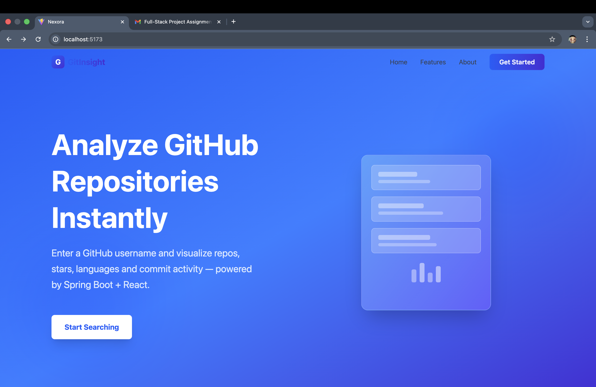
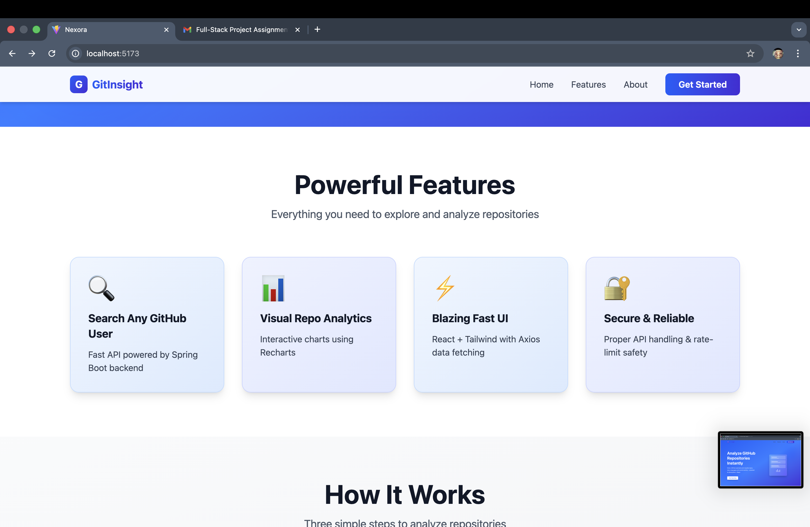
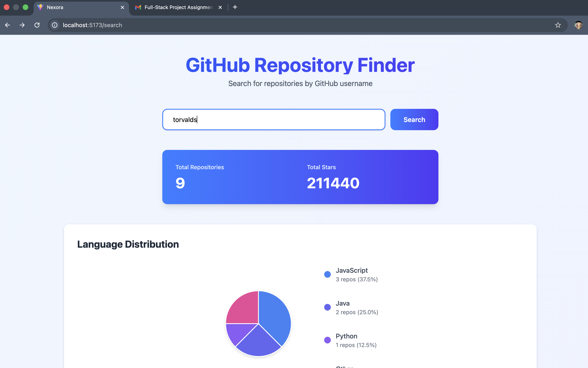
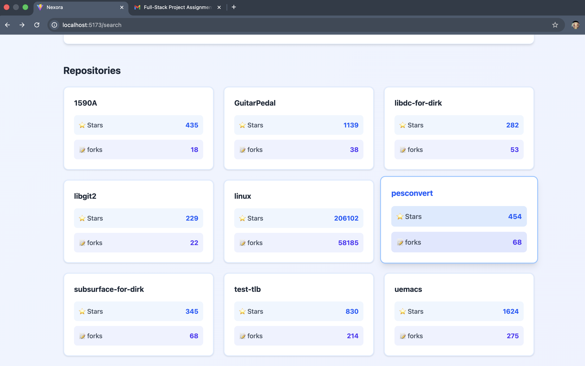
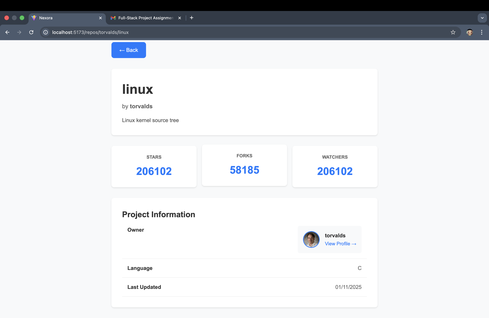

# 🧩 GitFolio — GitHub Repository Explorer

A full-stack web application built with **Spring Boot (Java)** and **React (Vite)** that allows users to search GitHub profiles, explore repositories, and view detailed repository insights — all through a beautifully responsive UI.

---

## 🚀 Features

- 🔍 **Search by GitHub username** to instantly view all public repositories.
- 📄 **View repository details** including description, stars, forks, watchers, and more.
- 🧠 **Integrated backend API** built with Spring Boot that fetches data directly from the GitHub REST API.
- 💾 **Axios + REST Template integration** for smooth data flow between frontend and backend.
- 🎨 **Elegant UI** with Tailwind CSS animations and responsive design.

---

## 🏗️ Tech Stack

### 🔹 Backend — Spring Boot (`XcellentProject`)

- **Java 17+**
- **Spring Boot 3+**
- **RestTemplate** for external API calls
- **Maven** for dependency management
- **Jackson** for JSON serialization
- **CORS enabled** for React integration

### 🔹 Frontend — React + Vite (`frontend`)

- **React 18+**
- **Vite** for fast builds
- **React Router DOM** for navigation
- **Axios** for HTTP requests
- **Tailwind CSS** for styling and animations

---

## 📁 Folder Structure

### 🧱 Backend — `XcellentProject`

```
XcellentProject/
│
├── src/
│   ├── main/
│   │   ├── java/in/XcellentTut/github/
│   │   │   ├── configuration/
│   │   │   │   └── RestTemplateConfig.java
│   │   │   ├── controller/
│   │   │   │   └── GitController.java
│   │   │   ├── dto/
│   │   │   │   ├── GitHubMapped.java
│   │   │   │   └── RepoList.java
│   │   │   ├── service/
│   │   │   │   └── GitHubService.java
│   │   │   └── GithubApplication.java
│   │   └── resources/
│   └── test/
│
├── pom.xml
└── target/
```

### 🎨 Frontend — `frontend`

```
frontend/
│
├── src/
│   ├── assets/
│   └── pages/
│       ├── Landing.jsx
│       ├── RepoDetails.jsx
│       ├── RepoList.jsx
│       └── SearchPage.jsx
│   ├── App.jsx
│   ├── main.jsx
│   ├── App.css
│   ├── index.css
│
├── public/
├── package.json
├── vite.config.js
└── README.md
```

---

## ⚙️ Backend Setup (Spring Boot)

### 1️⃣ Clone the project

```bash
git clone https://github.com/ayushchaudhary21/Xcellentproject.git
```

### 2️⃣ Configure Maven dependencies

If using IntelliJ or VS Code, they’ll auto-import.
Otherwise run:

```bash
mvn clean install
```

### 3️⃣ Run the Spring Boot server

```bash
mvn spring-boot:run
```

Your backend will start on **`http://localhost:8080`**

### 4️⃣ API Endpoints

| Endpoint                     | Method | Description                               |
| ---------------------------- | ------ | ----------------------------------------- |
| `/api/{username}`            | `GET`  | Fetch all public repositories of the user |
| `/api/{username}/{repoName}` | `GET`  | Fetch details of a specific repository    |

---

## 💻 Frontend Setup (React + Vite)

### 1️⃣ Move to the frontend directory

```bash
cd ../frontend
```

### 2️⃣ Install dependencies

```bash
npm install
```

### 3️⃣ Start the development server

```bash
npm run dev
```

Frontend runs by default at **`http://localhost:5173`**

---

## 🔗 Connecting Frontend & Backend

Make sure both are running:

- **Backend:** `http://localhost:8080`
- **Frontend:** `http://localhost:5173`

In your frontend code (e.g. `SearchPage.jsx`, `RepoDetails.jsx`), the API calls already point to:

```js
http://localhost:8080/api
```

✅ No proxy setup needed.

---

## 🧠 Key Files Overview

| File                      | Purpose                                     |
| ------------------------- | ------------------------------------------- |
| `GitController.java`      | Exposes REST endpoints for frontend         |
| `GitHubService.java`      | Handles API calls to GitHub                 |
| `RestTemplateConfig.java` | Configures RestTemplate Bean                |
| `SearchPage.jsx`          | User search input + repository list display |
| `RepoDetails.jsx`         | Detailed view of a specific repository      |
| `RepoList.jsx`            | List rendering of repositories with links   |
| `Landing.jsx`             | Introductory landing page                   |

---

## 🧩 Future Enhancements

- 🔐 OAuth integration for private repositories
- 📊 Add commit history and language statistics
- 🧠 Implement caching for repeated requests
- 🌐 Deploy on AWS / Vercel

---

## 📸 Screenshots







---

## 🧑‍💻 Author

**Ayush Chaudhary (Ayu)**
📚 Engineering Student | 💻 Future Java Developer with AI
🌐 GitHub: [@ayushchaudhary21](https://github.com/ayushchaudhary21)
